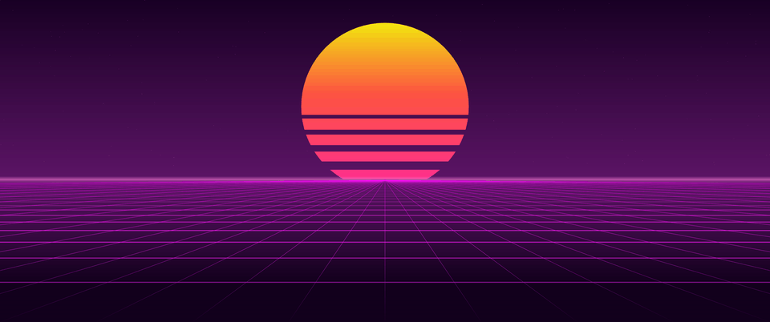
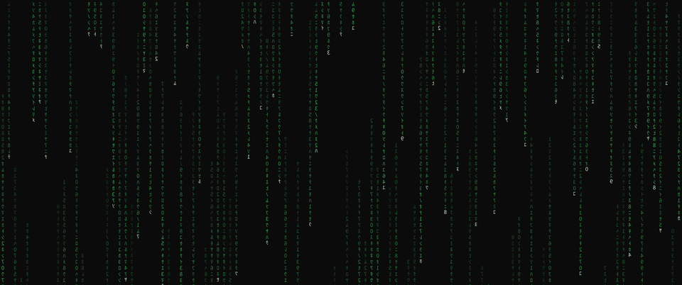
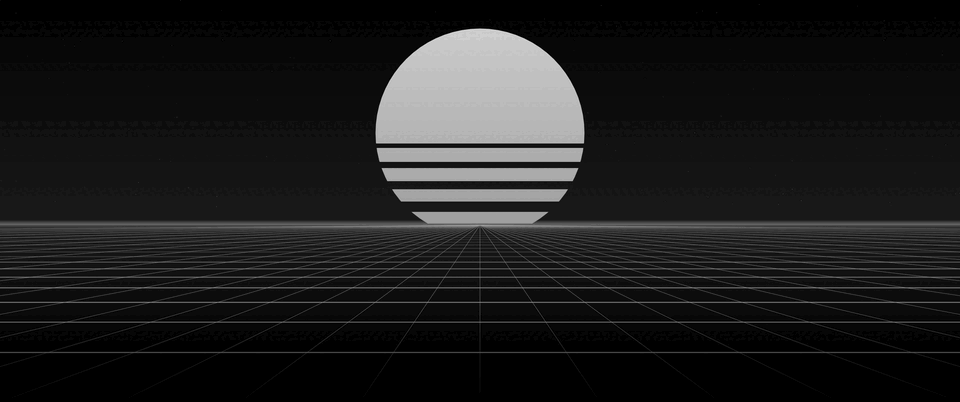
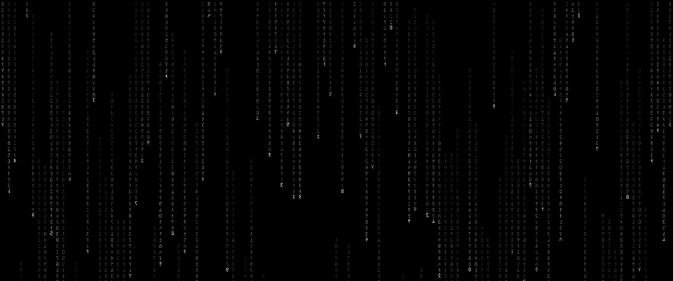
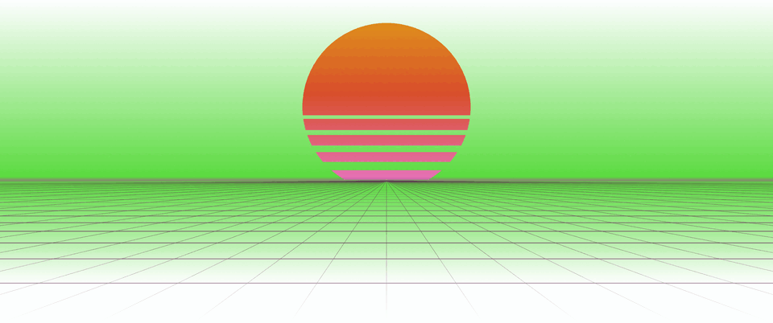
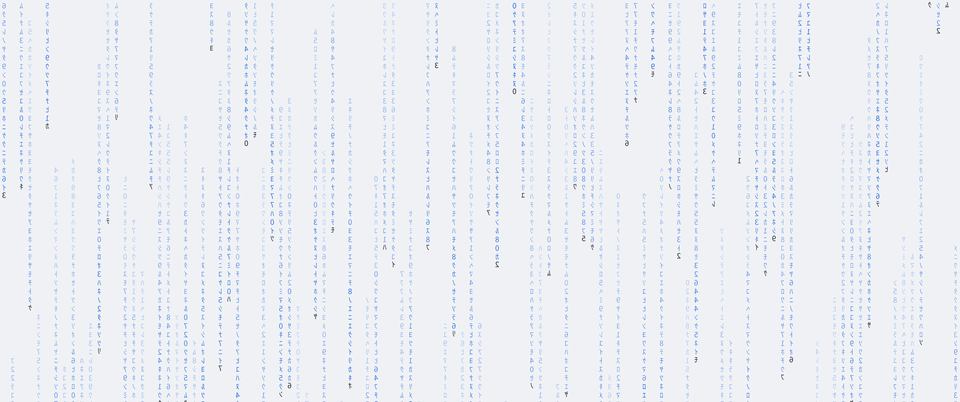

# Animated Backgrounds

Animated desktop backgrounds for Omarchy, drawn in the colours of whatever theme you have
active. Two effects: a synthwave sun and grid horizon, and falling code.





Both at the shipped defaults, captured on a 3440x1440 display.

## Install

```bash
omarchy plugin add https://github.com/ivanskodje/omarchy-animated-backgrounds.git --enable
```

Plugins run unsandboxed inside the shell process, so review the code before enabling it.

## Use

Open the background switcher (`Super + Ctrl + Space`, or `omarchy background`) and pick the one you want!

Your wallpaper stays where it is underneath, so its transitions and the double click gestures
on the desktop keep working.

## Themes

Both effects follow your active theme, with no setup. A monochrome theme gives a monochrome
effect, and light themes work as well as dark ones (mostly).

|  | animated-grid | animated-rain |
| --- | --- | --- |
| `vantablack` |  |  |
| `catppuccin-latte` |  |  |

A theme switch selects that theme's own wallpaper, so re-pick the animated one afterwards.

## Configuration

Nothing to set up. To change something, run one of these. Each prints the new value:

```bash
# Colours: follow the active theme (default), or use the built-in palettes
omarchy-shell animated-background themeColors true
omarchy-shell animated-background themeColors false
omarchy-shell animated-background themeColors toggle

# Falling code: dense (default) or light
omarchy-shell animated-background rainStyle dense
omarchy-shell animated-background rainStyle light
omarchy-shell animated-background rainStyle toggle

# Stop animating while windows cover every screen. Off by default
omarchy-shell animated-background pauseWhenCovered true
omarchy-shell animated-background pauseWhenCovered false
omarchy-shell animated-background pauseWhenCovered toggle

# Grid frame rate, the main cost dial. 20 by default
omarchy-shell animated-background fps 10

# Re-read the theme and reinstall the marker images
omarchy-shell animated-background refresh
```

Use `get` in place of a value to read one, such as
`omarchy-shell animated-background themeColors get`.

Settings are saved on the plugin's entry in `~/.config/omarchy/shell.json` and can be edited
there instead. Two more live there that you are unlikely to touch: `markers`, where false stops
the plugin writing marker images, and `poll`, where true helps if the plugin does not notice
your wallpaper changing. Disabling the plugin removes the entry, and the settings with it.

## Performance

Measured on a 20 thread machine driving 5120x1440 plus 3440x1440, both desktops visible. A
static wallpaper with the plugin enabled costs 0.2 percent.

| effect | cost |
| --- | --- |
| grid at 20 fps | 11 percent of one core |
| rain, dense | 25 percent |
| rain, light | 23 percent |

Lower `fps` to make it cheaper, and turn on `pauseWhenCovered` if your desktop is usually
buried. Smaller screens cost less, and a four thread laptop pays a much larger share. GPU and
wall power are not included.

## What it writes

Two marker images copied into `~/.local/state/omarchy/current/theme/backgrounds/`, which is
what makes them appear in the background switcher. Nothing else outside the plugin directory.
Omarchy recreates that directory on every theme switch, so the copies are disposable and get
replaced. Set `markers` to false to disable.

## Uninstall

```bash
omarchy plugin remove ivanskodje.animated-backgrounds
```

Selecting an ordinary wallpaper is enough to turn the effects off without uninstalling.

## Requirements

Omarchy 4 with shell plugin support. The rain asks for `Noto Sans CJK JP`; without a font
carrying halfwidth katakana it falls back to whatever substitutes.

## Limitations

- You do not see the theme change animation while an effect is running.
- The lock screen shows a blurred still, not the animation.
- Switcher thumbnails are stills in default colours, so they do not match your theme.
- Any image named `animated-grid.png` or `animated-rain.png` that the switcher can see will
  start the matching effect.

## Development

The effects draw on the Wayland bottom layer, above the wallpaper and below every window, with
an empty input region so clicks pass through. The built in wallpaper renderer is untouched.

The grid is split across two layer surfaces at the horizon. Qt Quick repaints a whole window
whenever any node in it changes, so the static sky commits once and only the floor repaints.

Colours come from the active theme's `colors.toml`. Two key schemas exist, named keys such as
`magenta` and numbered `color0` to `color15` for themes converted from `alacritty.toml`, so
every role names candidates in both. Numbered slots carry no reliable hue: `color2` is
nominally green but holds purple in one stock theme and orange in another. Roles are therefore
normalised by luminance rather than used raw, and light themes mirror the composition rather
than darken it.

The settings commands can be driven from the Omarchy menu on `Super + Space`. Add a row to
`~/.config/omarchy/extensions/omarchy-menu.jsonc`, where `checked` is a shell condition that
adds a check mark:

```jsonc
"trigger.toggle.animated-bg-colors": {
  "icon": "󰸉", "label": "Animated Background Colours",
  "checked": "[[ \"$(omarchy-shell animated-background themeColors get)\" == \"true\" ]]",
  "action": "omarchy-shell animated-background themeColors toggle"
}
```

Swap the verb for `rainStyle` or `pauseWhenCovered`.

`bash test/markers-test.sh` exercises `markers.sh` against a throwaway `HOME`: publication, the never-overwrite rule, symlinked paths, and a theme switch injected mid-operation.

## License

This project is MIT. 

The one vendored file, `ScreenRemapGuard.qml`, comes from Omarchy under its own MIT notice, reproduced in [docs/THIRD-PARTY-NOTICES.md](docs/THIRD-PARTY-NOTICES.md).
